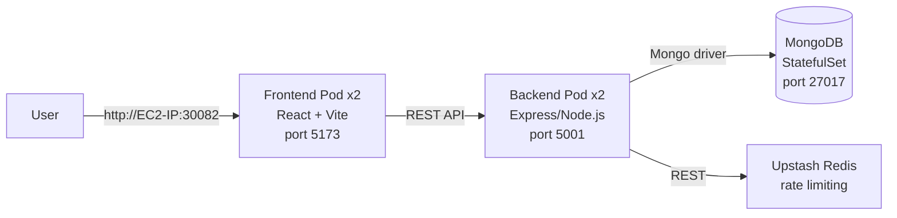

# MERN Notes App — Deployed on Kubernetes (kind)

A 3-tier MERN application (React + Express/Node.js + MongoDB) containerized with
Docker and deployed on a local Kubernetes cluster (via [kind](https://kind.sigs.k8s.io/))
running on an AWS EC2 instance. Built as Day 3 of a 15-day DevOps challenge.

## Architecture




| Tier | Tech | K8s Resource | Exposure |
|---|---|---|---|
| Frontend | React + Vite | Deployment (2 replicas) | NodePort `30082` |
| Backend | Express / Node.js | Deployment (2 replicas) | ClusterIP (internal only) |
| Database | MongoDB 7 | StatefulSet + PVC | Headless Service (internal only) |
| Cache/Rate-limit | Upstash Redis (managed, external) | — | Reached via REST API |

## Repository structure

```
.
├── BE/                          # Express backend source + Dockerfile
│   ├── Dockerfile
│   └── .dockerignore
├── FE/                          # React frontend source + Dockerfile
│   ├── Dockerfile
│   └── .dockerignore
├── k8s/
│   ├── 00-namespace.yaml
│   ├── 01-config-and-secret.yaml   # placeholder values only — see Secrets section
│   ├── 02-mongodb.yaml
│   ├── 03-backend.yaml
│   └── 04-frontend.yaml
├── kind-config.yaml              # NodePort mapping for kind
├── docker-compose.yml            # local testing without K8s
├── .env.example
├── setup-server.sh               # EC2 base setup (Docker, git, AWS CLI, etc.)
└── README.md
```

## Prerequisites

- An AWS EC2 instance (Ubuntu 22.04, `t3.medium` or larger — 2 vCPU / 4GB+ RAM)
- Security group allowing inbound on `22` (SSH) and `30082` (frontend NodePort)
- Docker Hub images already built and pushed (see [Build & push images](#build--push-images)),
  or use the pre-built ones referenced in the manifests:
  - `manishk57107/mern_notesapp-backend:v1.0`
  - `manishk57107/mern_notesapp-frontend:v1.0`

## Setup from scratch

### 1. Base server setup
Run the included script to install Docker, Git, AWS CLI, and general utilities:
```bash
chmod +x setup-server.sh
./setup-server.sh
newgrp docker   # apply the docker group change without logging out
```

### 2. Install kubectl
```bash
curl -LO "https://dl.k8s.io/release/$(curl -L -s https://dl.k8s.io/release/stable.txt)/bin/linux/amd64/kubectl"
sudo install -o root -g root -m 0755 kubectl /usr/local/bin/kubectl
rm -f kubectl
kubectl version --client
```

### 3. Install kind
```bash
curl -Lo ./kind https://kind.sigs.k8s.io/dl/v0.33.0/kind-linux-amd64
chmod +x ./kind
sudo mv ./kind /usr/local/bin/kind
kind version
```

### 4. Create the cluster
```bash
kind create cluster --config kind-config.yaml
kubectl cluster-info --context kind-mern-notes
kubectl get nodes
```
`kind-config.yaml` maps container port `30082` to the same port on the EC2 host, since
kind's "nodes" are Docker containers and NodePorts aren't reachable from outside without
an explicit port mapping.

### 5. Build & push images (optional — skip if reusing the ones above)
```bash
docker build -t <your-dockerhub-username>/mern_notesapp-backend:v1.0 ./BE
docker build -t <your-dockerhub-username>/mern_notesapp-frontend:v1.0 ./FE
docker push <your-dockerhub-username>/mern_notesapp-backend:v1.0
docker push <your-dockerhub-username>/mern_notesapp-frontend:v1.0
```
If you use your own image names/tags, update them in `k8s/03-backend.yaml` and
`k8s/04-frontend.yaml`.

### 6. Configure secrets
`k8s/01-config-and-secret.yaml` ships with **placeholder** values — fill in real
base64-encoded values before applying:
```bash
echo -n 'admin' | base64
echo -n '<mongo-root-password>' | base64
echo -n 'mongodb://admin:<mongo-root-password>@mongo-service:27017/notes_app?authSource=admin' | base64
echo -n '<your upstash rest url>' | base64
echo -n '<your upstash rest token>' | base64
```
Paste each result into the matching `data:` field. If your password has reserved
characters (`?`, `@`, `:`, `/`, etc.), URL-encode them before building the connection
string, e.g. `python3 -c "import urllib.parse; print(urllib.parse.quote('yourpass', safe=''))"`.

### 7. Deploy
```bash
kubectl apply -f k8s/
kubectl get pods -n mern-notes -w
```

### 8. Verify
```bash
kubectl get all -n mern-notes
kubectl logs <backend-pod-name> -n mern-notes
```

### 9. Access the app
```
http://<EC2-public-IP>:30082
```

## Local testing without Kubernetes

```bash
cp .env.example .env
# fill in UPSTASH_REDIS_REST_URL and UPSTASH_REDIS_REST_TOKEN
docker compose up --build
```
- Backend → http://localhost:5001
- Frontend → http://localhost:5173
- MongoDB → localhost:27017

## Cleanup

```bash
kind delete cluster --name mern-notes
```

---

## Challenges faced & how they were solved

**1. `ImagePullBackOff` on the MongoDB pod**
The node couldn't pull `mongo:7`, usually from a slow/rate-limited pull or a network
hiccup on the EC2 host. Diagnosed with:
```bash
kubectl describe pod mongo-0 -n mern-notes   # check Events at the bottom
docker pull mongo:7                          # isolate: is it Docker or K8s?
```
Fixed by re-pulling manually and, when needed, loading the image directly into kind:
```bash
kind load docker-image mongo:7 --name mern-notes
kubectl delete pod mongo-0 -n mern-notes     # StatefulSet recreates it
```

**2. MongoDB auth breaking the connection string**
Once `MONGO_INITDB_ROOT_USERNAME`/`MONGO_INITDB_ROOT_PASSWORD` were added to enable
auth, `MONGO_URI` had to be updated to match — including `?authSource=admin` — or the
backend couldn't authenticate. Any reserved characters in the password (e.g. `?`, `@`)
had to be URL-encoded separately from the base64 encoding used to store the value in
the K8s Secret; conflating the two encoding steps was an easy mistake to make.

**3. `localhost` in `MONGO_URI` doesn't work inside a pod**
Copying the `.env` value straight from local development (`mongodb://...@localhost:27017/...`)
silently fails in the cluster — `localhost` inside the backend pod refers to the backend
pod itself, not the MongoDB pod. Fixed by pointing at the Service name instead:
`mongo-service`.

**4. NodePort unreachable on kind**
Unlike a real multi-node cluster, kind's nodes are Docker containers, so a NodePort
Service alone isn't reachable from the EC2 host or the internet. Fixed with an
`extraPortMappings` entry in `kind-config.yaml`, mapping the container's NodePort to
the same port on the host — plus opening that port in the EC2 security group.

**5. CORS errors between frontend and backend**
*(Open/in-progress at time of writing.)* The frontend hits the backend API from the
browser at a different origin (`http://<EC2-IP>:30082` vs. the backend's internal
ClusterIP address), and the backend's CORS configuration doesn't yet allow that origin.
Planned fix: explicitly set the allowed origin in the backend's CORS middleware (e.g.
via an `ALLOWED_ORIGIN` env var read from the ConfigMap) rather than leaving it
defaulted to `localhost`.

## Future improvements
- Resolve the CORS issue above properly (env-driven allowed origin, not hardcoded)
- Add readiness/liveness probes once the app exposes a health endpoint
- Move to Ingress instead of NodePort for a more realistic setup
- Add a HorizontalPodAutoscaler for the backend/frontend Deployments
- CI pipeline to build/push images and `kubectl apply` on merge

## Credits
Based on a MERN CRUD notes app, containerized and deployed as part of a 15-day DevOps
challenge (Day 3: 3-tier app on Kubernetes).